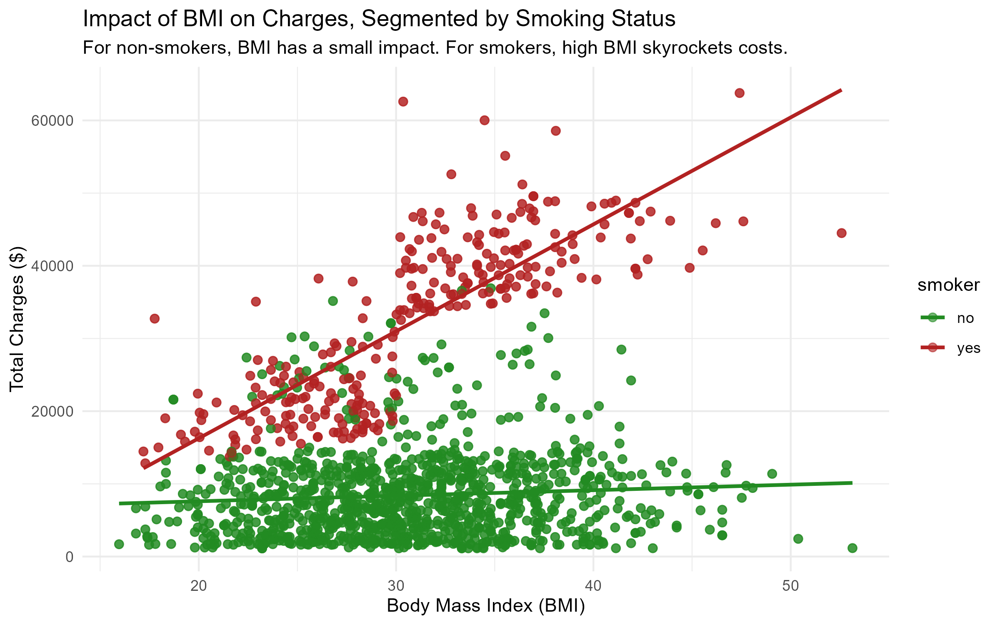

## 1. Background & Business Context
A major medical insurance provider is seeking to deepen its understanding of the underlying determinants that impact individual health insurance costs. To remain competitive and financially stable, the company needs to evolve beyond generalized pricing and move toward a highly accurate, data-driven approach to risk assessment.

**The Dataset:** To investigate this, we analyzed a comprehensive dataset of individual policyholder profiles. This data encompasses a variety of demographic and health metrics, including:
- Age and Sex
- Body Mass Index (BMI)
- Number of Dependents (Children)
- Smoking Status
- Geographic Region

**Project Objectives:**
This analysis serves two primary purposes:

1. **Insight Generation:** To shed light on the pivotal elements contributing to increased medical expenses, allowing the company to make informed, strategic decisions regarding pricing and targeted health interventions.

2. **Predictive Forecasting:** To serve as the foundation for a machine learning engine capable of accurately forecasting expected medical costs for new policyholders based on their unique profiles.

## 3. Key Findings & Visual Insights
During the Exploratory Data Analysis (EDA) phase, we discovered that age and Body Mass Index (BMI) have a baseline impact on costs, but **smoking status** is the absolute largest financial driver.

Furthermore, smoking acts as a severe multiplier when combined with a high BMI. 

*As seen in the chart above, patients with a high BMI who do not smoke see only a marginal increase in costs. However, patients who smoke and have a high BMI experience an exponential surge in medical charges.*

## 4. Predictive Modeling: Methodology & Business Impact
To transition from historical analysis to future prediction, we built a machine learning engine capable of forecasting individual patient costs. We trained and evaluated two distinct algorithms to balance mathematical transparency with raw predictive power.

### What We Used & Why
1. **Multiple Linear Regression (The Baseline):** We started with this classical statistical model because it is highly interpretable. It assigns a specific, isolated dollar value to every variable, allowing us to explain to stakeholders exactly how much an individual factor contributes to a bill.
2. **Random Forest (The Advanced Champion):** We then trained a Random Forest, an ensemble algorithm that builds hundreds of "decision trees." We used this because standard linear models struggle to understand compounding variables (like the exponential penalty of having a high BMI *while* being a smoker). Random Forest naturally detects and maps these complex, hidden patterns.

### The Technical Results
Both models were evaluated on a 20% "holdout" set of unseen data to ensure they could generalize to new patients rather than just memorizing historical data.

- **Statistical Validation:** The Linear Regression yielded an R-squared of approximately 0.74, confirming that our selected variables account for 74% of the variance in insurance costs. The p-values for age, BMI, and smoking were near zero (< 0.05), strictly proving their statistical significance.

- **Predictive Accuracy:** The Random Forest model achieved a significantly lower **Root Mean Squared Error (RMSE)** than the Linear Regression baseline. This confirms that its dollar-amount predictions are mathematically tighter and closer to actual real-world charges.

### What This Means for the Business
By finalizing and saving the Random Forest model, the business now possesses a highly accurate, automated quoting engine.

- **Quantified Risk:** The models elevate the "smoking penalty" from a general assumption to a mathematical certainty. The baseline model isolated the cost of smoking to an average premium increase of roughly $23,000, holding all other demographics equal.

- **Automated & Dynamic Quoting:** Underwriters and sales agents can input a prospective patient's basic data into this predictive engine to instantly generate a precise, risk-adjusted baseline quote. This protects the provider's profit margins by ensuring high-risk profiles are priced accurately from day one.

## 5. Strategic Recommendations
1.  **Prioritize Smoking Cessation:** Because smoking is the heaviest financial burden, the highest return on investment will come from subsidizing programs that help policyholders quit smoking.
2.  **Implement Dynamic Quoting:** The trained Random Forest model can be deployed as a backend tool for insurance agents to generate instant, highly accurate baseline quotes based on just a few basic patient inputs.

---

### Interactive Dashboard
This project includes a live, interactive dashboard hosted on Tableau Public, allowing stakeholders to dynamically slice the insurance cost data by region and smoking status.

**[Launch Live Tableau Dashboard](https://public.tableau.com/views/MedicalInsuranceCostPrediction/MedicalInsuranceCostDrivers_?:language=en-US&publish=yes&:sid=&:redirect=auth&:display_count=n&:origin=viz_share_link)**

